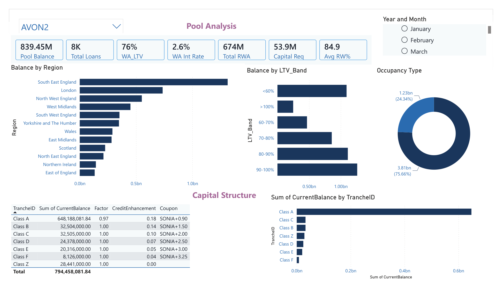
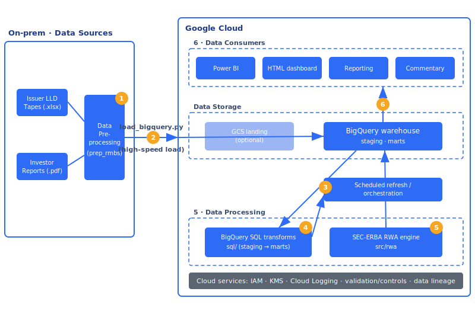

# RMBS RWA Pipeline

A UK RMBS surveillance **and** securitisation regulatory-capital (RWA) platform.
It ingests issuer loan-level data tapes and investor reports, builds a BigQuery cloud
data warehouse, computes **Basel 3.1 / UK CRR securitisation RWA (SEC-ERBA)** on the
note tranches, and serves the results to Power BI and an interactive HTML dashboard.

## What this project demonstrates

This project is a portfolio piece built to evidence three core competencies:

1. **Securitisation knowledge** — working fluently with real UK RMBS data: the loan-level
   data tape and investor report, prepayment (CPR/SMM/PSA), delinquency and arrears, default
   and loss severity, the note capital structure, and Basel 3.1 / UK CRR securitisation
   regulatory capital (SEC-ERBA RWA).
2. **ETL pipeline engineering** — a real source-to-warehouse pipeline: ingestion and
   validation in Python, a BigQuery cloud data warehouse (staging → marts), SQL
   transformations, reconciliation controls and documented data lineage.
3. **Power BI dashboard depth** — a properly modelled star schema with ~50 DAX measures and
   a build guide, designed for genuine management information, not just charts.

> The interactive HTML dashboard in this repo is a **working prototype of the Power BI
> dashboard** — built first to design and agree the exact layout, metrics and interactions
> before assembling them in Power BI Desktop.

## What it does

- **Ingest** — parses the European DataWarehouse AR-field loan-level tape (8,000+ loans),
  decodes coded fields, derives investor metrics (CPR/SMM/PSA, delinquency buckets, LTV,
  loss severity), and the redemptions/defaults log.
- **Warehouse** — loads curated facts and dimensions into **BigQuery** (`staging` + `marts` datasets).
- **RWA** — computes tranche attachment/detachment, thickness, SEC-ERBA risk weights,
  RWA and 8% capital per tranche and per deal; tracks period-on-period movement.
- **Serve** — a dependency-free HTML dashboard (5 surveillance pages + RWA) and a
  Power BI model (star schema + ~50 DAX measures + build guide).

## Power BI Dashboard

Three-page dashboard connected to BigQuery via native connector:

| Page | Purpose | Key Visuals |
|------|---------|-------------|
| **Pool Analysis** | Pool composition snapshot | KPIs (Balance, Count, WA_LTV, WA_Rate), Region bar, LTV band bar, Occupancy donut |
| **Capital Structure** | Tranche-level RWA | Waterfall of tranches, RW by rating, Capital requirements |
| **Time Series** | Performance over time | Pool Factor, CPR, Arrears 90+, Balance trends |




## Repo layout

```
rmbs-rwa-pipeline/
├── src/
│   ├── ingest/        # 1 · parse & validate tapes / IRs
│   ├── warehouse/     # 2-3 · load BigQuery (staging + marts)
│   ├── transform/     # 4 · python transform helpers
│   ├── rwa/           # 5 · SEC-ERBA RWA engine + movement
│   └── reporting/     # 6 · HTML preview / exports
├── sql/               # 4 · SQL transformations & controls
├── powerbi/           # DAX measures + build guide
├── docs/              # pipeline.md (architecture), lineage, methodology, preview
├── config/            # deals.yml registry
├── tests/             # pytest (RWA logic, reconciliations)
├── data/              # warehouse + generated CSVs (gitignored)
├── WIP.md             # running work-in-progress log
└── TASKS.md           # full task checklist
```

## Architecture



Source → pre-processing → BigQuery warehouse → SQL/RWA processing → consumers, on Google Cloud.
See **[docs/pipeline.md](docs/pipeline.md)** for the stage-by-stage mapping and run order, and
**[docs/decisions/0001-ingestion-and-transformation.md](docs/decisions/0001-ingestion-and-transformation.md)**
for why ingestion runs locally and transformation runs as BigQuery SQL.

## SEC-ERBA RWA Engine

The pipeline includes a **Basel 3.1 / UK CRR securitisation RWA engine** implementing the
**External Ratings-Based Approach (SEC-ERBA)** — the regulatory method for calculating
risk-weighted assets on rated securitisation positions.

### How it works

**Risk-Weighted Assets (RWA)** determine how much capital a bank must hold against a position:

```
RWA = Exposure × Risk Weight
Capital Requirement = RWA × 8%
```

SEC-ERBA assigns risk weights based on three factors:

| Factor | Impact |
|--------|--------|
| **Credit Rating** | AAA → 15%, BBB → 105%, Unrated → 1250% |
| **Seniority** | Senior tranches get lower risk weights |
| **Maturity** | Longer WAL → higher risk weight (interpolate 1yr ↔ 5yr) |

### Capital structure concepts

```
         100% ┌─────────────────────────────┐
              │     Class A (Senior)        │ ← AAA, 85% thickness, 15-20% RW
         15%  ├─────────────────────────────┤
              │     Class B (Mezz)          │ ← AA, 7% thickness
          8%  ├─────────────────────────────┤
              │     Class C (Mezz)          │ ← A, 4% thickness
          4%  ├─────────────────────────────┤
              │     Class D (Junior)        │ ← BBB, 3% thickness
          1%  ├─────────────────────────────┤
              │     FLP (First Loss)        │ ← Unrated, 1250% RW
          0%  └─────────────────────────────┘
              ↑                             ↑
         Attachment                    Detachment
```

- **Attachment point (A)** = where losses start hitting this tranche
- **Detachment point (D)** = where losses fully wipe out this tranche
- **Thickness = D − A** = tranche size as % of pool
- **Credit Enhancement (CE)** = subordination below senior tranche (here: 15%)

### Example output (AVON2)

```
Tranche    Rating   Balance       Thick   RW       RWA           Capital
─────────────────────────────────────────────────────────────────────────
Class A    AAA      £713.5M       85.0%   18.1%    £129.4M       £10.3M
Class B    AA       £58.8M         7.0%   46.4%    £27.2M        £2.2M
Class C    A        £33.6M         4.0%   85.4%    £28.7M        £2.3M
Class D    BBB      £25.2M         3.0%  159.6%    £40.2M        £3.2M
FLP        NR       £8.4M          1.0% 1250.0%   £104.9M        £8.4M
─────────────────────────────────────────────────────────────────────────
TOTAL               £839.4M              39.4%    £330.4M       £26.4M
```

**Key insight:** The unrated First Loss Piece (FLP) is only 1% of the pool but consumes
32% of total RWA (£104.9M ÷ £330.4M). This is the Basel penalty for holding equity risk.

### Code structure

```
src/rwa/
├── sec_erba.py         # Risk weight lookup table (17 ratings × 2 seniorities)
├── capital_structure.py # Tranche and CapitalStructure dataclasses
└── rwa_calculator.py    # RWA = EAD × RW, Capital = RWA × 8%
```

Run: `python scripts/run_rwa.py`

## Quickstart

```bash
python -m venv .venv && source .venv/bin/activate   # Windows: .venv\Scripts\activate
pip install -r requirements.txt
gcloud auth application-default login               # BigQuery auth (one-time)
# set project_id + datasets in config/settings.yml, then:
python -m src.ingest.prep_rmbs        --deal AVON2  # tape -> curated CSVs
python -m src.warehouse.load_bigquery --deal AVON2  # CSVs -> BigQuery
python -m src.rwa.sec_erba            --deal AVON2  # RWA + capital
```

Warehouse = **BigQuery** (Google Cloud). Power BI connects via its native BigQuery connector.

## Status

Avon Finance No.2 is fully loaded; Bletchley Park, Canterbury, Hadrian and Stratton are
registered and awaiting data. Current build state and next steps are tracked in
**[WIP.md](WIP.md)** and **[TASKS.md](TASKS.md)**.

## Live demo (GitHub Pages)

Once pushed, enable **Settings ▸ Pages ▸ Deploy from branch ▸ main ▸ /docs** to publish the
interactive dashboard at `https://<your-username>.github.io/rmbs-rwa-pipeline/`.
Full steps: [docs/GITHUB_SETUP.md](docs/GITHUB_SETUP.md).

## Put it on GitHub

```bash
cd rmbs-rwa-pipeline
git init -b main
git add .
git commit -m "Initial commit: RMBS RWA pipeline scaffold"
# create an empty repo on github.com (no README), then:
git remote add origin https://github.com/<you>/rmbs-rwa-pipeline.git
git push -u origin main
```
> Tip: keep this repo **outside** the OneDrive-synced data folder to avoid sync conflicts.
> Deal tapes and the warehouse are gitignored so no client data is ever pushed.

## Disclaimer
Built from public-style securitisation data for learning/demonstration. The RWA figures
use documented, simplified assumptions and are **not** a production regulatory calculation.
