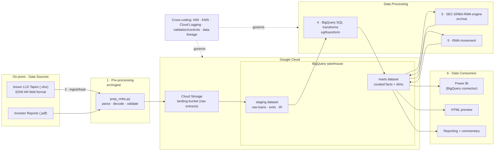

# Pipeline Architecture

Source → preprocessing → cloud warehouse → processing → consumers — the same shape as the
reference cloud architecture, implemented on **Google Cloud (BigQuery)** with a local Python
ingestion layer.



## Stage mapping (reference diagram → this project on GCP)

| Reference architecture | This project | Implementation |
|---|---|---|
| Data Sources (on-prem) | Issuer tapes + investor reports | `Issuers/<Deal>/` |
| 1 · Data Pre-processing | Parse EDW tape, decode, derive, validate | `src/ingest/prep_rmbs.py` |
| 2 · High-speed transfer | Load curated frames to cloud | `src/warehouse/load_bigquery.py` |
| COS Bucket | Cloud Storage landing bucket | GCS (optional raw stage) |
| Secure Database | **BigQuery** `staging` + `marts` datasets | `config/settings.yml` |
| 4 · Code Engine (transform) | BigQuery SQL transformations | `sql/transform/*.sql` |
| 5 · Event Handler (processing) | SEC-ERBA RWA engine + movement | `src/rwa/sec_erba.py` |
| 6 · Data Consumers | Power BI, HTML preview, reporting | `powerbi/`, `docs/`, `src/reporting/` |
| Cloud services (IAM/KMS/logging) | IAM, KMS, Cloud Logging, controls, lineage | GCP + `docs/data_lineage.md` |

*Production-native equivalents (not required to run locally): Cloud Run for the Code Engine,
Pub/Sub for the Event Stream, Cloud Functions for the Event Handler.*

## Run order

```bash
gcloud auth application-default login            # one-time auth
python -m src.ingest.prep_rmbs   --deal AVON2    # 1: tape -> curated CSVs
python -m src.warehouse.load_bigquery --deal AVON2   # 2-3: CSVs -> BigQuery staging
bq query --use_legacy_sql=false < sql/transform/marts.sql   # 4: build marts
python -m src.rwa.sec_erba       --deal AVON2    # 5: RWA + capital -> marts
python -m src.reporting.make_preview             # 6: refresh HTML preview
```
